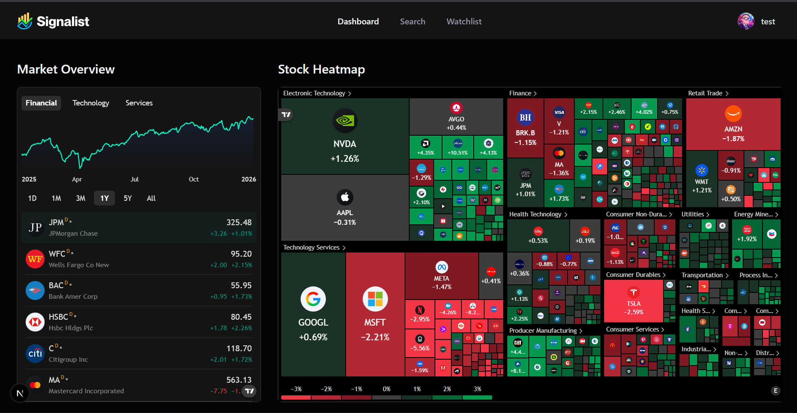

# 📈 Signalist – Stock Market Analysis Platform

Signalist is a modern stock market analysis web application that provides real-time market insights, interactive visualizations, and personalized watchlists. The platform is designed to help users track market trends, analyze stocks efficiently, and make informed financial decisions using reliable data and rich visual tools.

---

## 🔗 Live Preview
[signalist-one-pink.vercel.app](https://signalist-one-pink.vercel.app)

---

## 🛠 Tech Stack

### Frontend
- Next.js (App Router)
- React
- Tailwind CSS
- shadcn/ui

### Backend
- Next.js API Routes
- Node.js runtime

### Database
- MongoDB

### Authentication
- better-auth (token-based authentication)
- React-side session caching

### Market Data & Visualization
- TradingView Widgets (Charts, Heatmap, Market Overview)
- Finnhub API (stock prices & news)

---

## ✨ Features

### ✅ Implemented Features
- User authentication (sign up / login)
- Secure token-based session handling
- Market overview dashboard with sector-based performance
- Daily personalized email with market stories tailored to the user’s watchlist
- Interactive stock heatmap with color-coded movement
- Advanced stock charts powered by TradingView
- Stock search functionality
- Personalized watchlist (add/remove stocks)
- Persistent user data using MongoDB
- Fully responsive dark-themed UI

### 🚧 Planned Features
- API rate limiting for better security
- Server-side & Redis-based caching
- Background data revalidation
- WebSocket-based real-time updates
- Performance optimization for large datasets

---

### Dashboard
- Displays overall market trends
- Sector-wise performance tracking
- Interactive time range selection (1D, 1M, 1Y, etc.)

### Stock Heatmap
- Visual market representation across sectors
- Size indicates market cap
- Color indicates price movement

### Watchlist
- Save favorite stocks
- User-specific persistent storage
- Quick access to tracked assets

---

